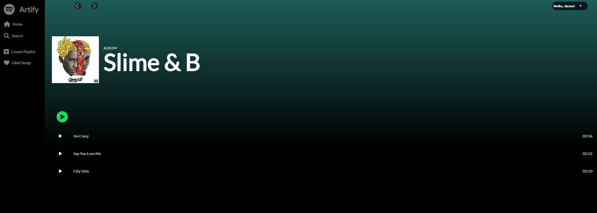

# Background
Artify is a online streaming application that is a clone of Spotify. Users need an account to access the service but worry not, a demo user account is provided for easy access into the application. Users can select from popular albums and play a song at the click of a button.
 
 
Check it out <a href="https://artify-el.herokuapp.com/#/us" target="_blank">here!</a>

# Technologies
    - Ruby 2.5.1
    - Rails 5.2.6

- Dependencies:
    + `@babel/core`
    + `@babel/preset-env`
    + `@babel/preset-react`
    + `babel-loader`
    + `react`
    + `react-dom`
    + `react-redux`
    + `react-router-dom`
    + `redux`
    + `redux-logger`
    + `webpack`
    + `webpack-cli`

# Technical Challenges

- The ability to switch the song that is playing is a simple feature that I initially struggled with. It challenged my fundamental understanding of react, props, and state. I set it up so that there is always a `currentSong` part of the state that I wanted to switch out with a new song that is selected. My first attempts at this problem properly set a currentSong but I could not switch the song after. I realized I was changing the local state but not the global state. There were many ways to handle this function however, with my design, I found that it was essential to use a thunk action creator to make an ajax request to properly update state. 

*Code snippet of the event handler function that uses a thunk action creator to assign current song*

# Application Snippets

